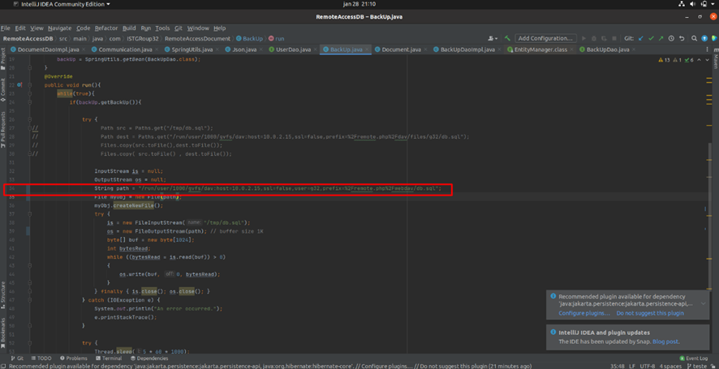

# RemoteAccessDocument
 
 Network and Computer Security 2021-2022 project group32.

## Authors

**Group AG32**


89478 [João Serras](mailto:nuno591lopes@gmail.com)

92447 [David Lima](mailto:davidazevedolima@tecnico.ulisboa.pt)

92474 [Guillermo Bettencourt](mailto:guillermo.bettencourt@tecnico.ulisboa.pt)

#Instructions

**1) Install and setup postgres locally:**
 
Insert following commands in your terminal:
```
 - sudo apt install postgresql
```
```
 - sudo service postgresql start
```
```
 - sudo su -l postgres
```
```
 - createdb <databaseName>
```
```
 - psql <databaseName>
```
```
- CREATE USER <yourUsername> WITH SUPERUSER LOGIN PASSWORD '<yourPassword>';
```
```
 - \q
```
```
 - exit
```

Then, inside the RemoteAccessDB folder, open RemoteAccessDB\src\main\resources\application.properties 
and fill the following parameters with your information:

```
#Your postgres database address
spring.datasource.url=jdbc:postgresql://localhost:<port>/<databaseName>
#Your postgresUsername
spring.datasource.username=<yourUsername>
#Your postgres password
spring.datasource.password=<yourPassword>
```

**2) Install and setup NextCloud (Not working after git merge, please skip):**
- Sign up to a nextcloud provider to get a nextcloud server running(https://nextcloud.com/signup/);

- Setup your password and remember it for future use.

- Go to settings.

- Go to mobile & desktop and copy link as shown in picture;

- Open settings and go to online accounts and click nextcloud.

- Paste link in server and fill username and password.

- Open file manager in the cloud and drag one of the file/directories to a terminal( Keep app open in this directory).
Copy path and open backup.java and paste path to line 34.



**3) Configure connection between server and database service:**

- Inside the RemoteAccessDB folder, open RemoteAccessDB\src\main\resources\application.properties
   and fill "communication.port" with your desired port:

```
communication.port=[your port]
```

This is the port where the RemoteAccessDB accepts connections requests from the Server.

- Then inside the RemoteAccessDocument folder, open RemoteAccessDocument\src\main\resources\application.properties 
and fill "communication.port" with the same port:

```
communication.port=[your port]
```

**5) Build and run:**

- If needed, install [Maven](https://maven.apache.org/download.cgi).
- Then run the following command inside the RemoteAccessDB folder:
```
mvn clean spring-boot:run
```
- Now do the same in the RemoteAccessDocument folder:
```
mvn clean spring-boot:run
```

**6) Test project on your browser:**

Go to your desired browser (only tested in Google Chrome and Microsoft Edge)
, if tested locally, go to [https://localhost:8443](https://localhost:8443)